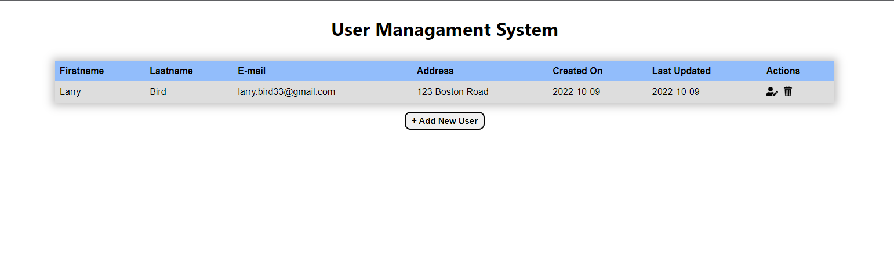
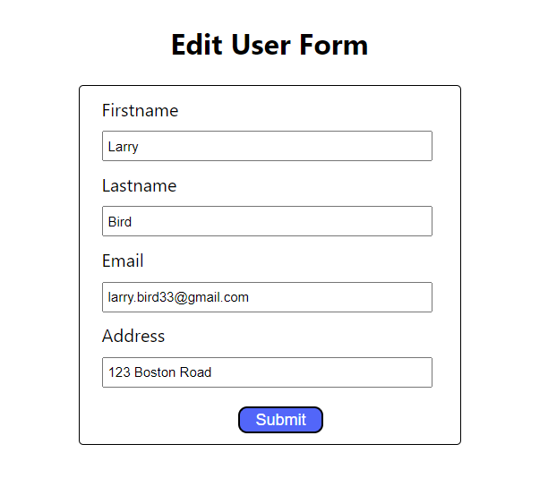
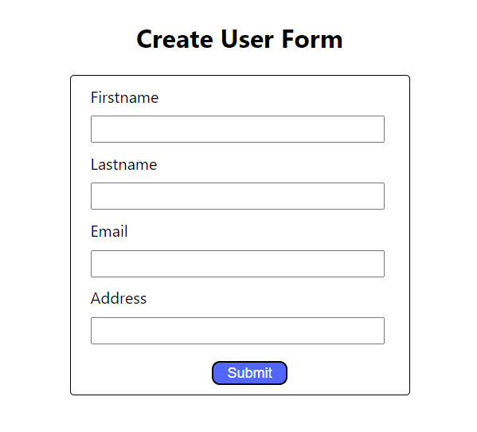

# UserManagementRestApi

## Objective

-   Create a RESTful API Server Using the MEAN Stack (MongoDB, Express, Node.js, React).
-   Use React.js for the client side of the API. 

## Technologies:

-   Node.js
-   JavaScript
-   Express js
-   mongoose
-   React js
-   Axios

## Usage

1.  Add your MONGO_URI to the .env file
2.  Install dependencies:   - &nbsp; `npm install` in UserManagementRestApi   - &nbsp; `cd frontend` then run `npm install`
3.  Run `npm run server` 
4.  Run `npm run client` 

## Images

